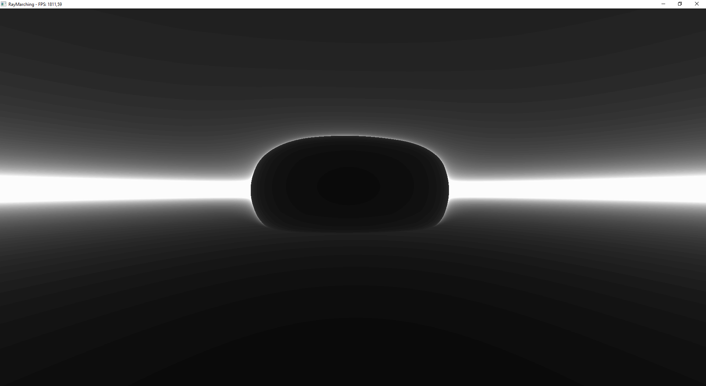
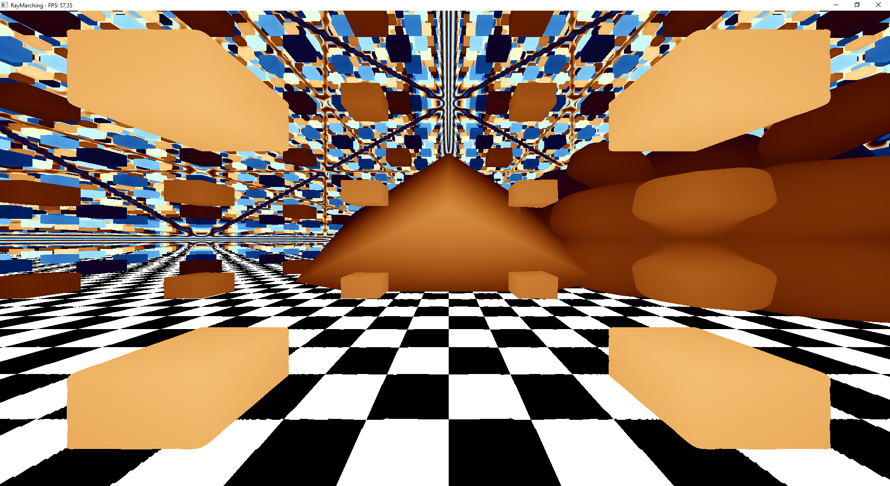
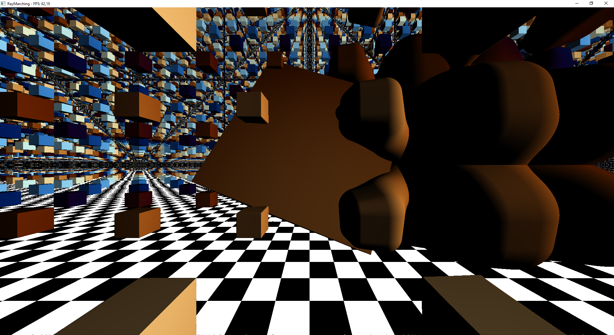

# RayMarcher
Simple raymarching implementation in C# using OpenTK (OpenGL)

## This would not be possible withouth these sources
- [@kishimisu Youtube video](https://www.youtube.com/watch?v=khblXafu7iA)
- [Signed Distance Functions Article](https://iquilezles.org/articles/distfunctions/)
- [Checkerboard pattern](https://www.ronja-tutorials.com/post/011-chessboard/)
- [Palletes](https://iquilezles.org/articles/palettes/)